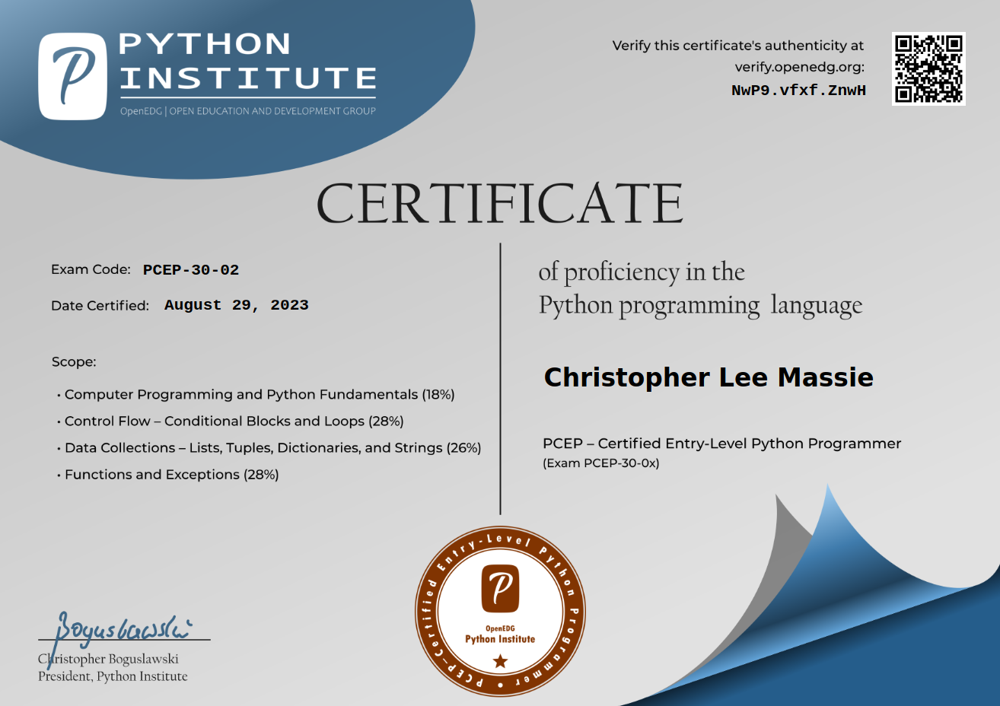

# Python Certifications Progress

Welcome to my personal repository where I document my journey through the [Python Institute's](https://pythoninstitute.org/) programmer certifications. This repo serves as a living record of the scripts and projects I've developed while studying for these certifications. It's designed to showcase my growth as a Python programmer, from understanding the basics to mastering advanced concepts in Python development, testing, and data analytics.

## About The Python Institute

The Python Institute is dedicated to promoting Python programming, training a new generation of Python programmers, and supporting professional careers in technology. Their comprehensive certification tracks are designed to validate programming skills in Python and related technologies through a rigorous testing process. For more details on the certification tracks offered by the Python Institute, visit their [Certification Roadmap](https://pythoninstitute.org/certification-tracks).

## Certification Verification

To ensure the authenticity and validity of the certifications, you can verify them through the [Certification Verification Page](https://verify.openedg.org).

## Certification Roadmap and Progress

Here's a glance at the certifications I am working towards, along with my current progress:

### General-Purpose Programming

- [x] **PCEP™ – Certified Entry-Level Python Programmer**

  The PCEP certification has helped me grasp the fundamental concepts of Python programming, including syntax, semantics, and the runtime environment.  
    
  [Verify Digital Certificate](https://verify.openedg.org/?id=NwP9.vfxf.ZnwH)
  **Certification Code**: `NwP9.vfxf.ZnwH`
  

- [ ] **PCAP™ – Certified Associate Python Programmer**  
  Next on my journey is the PCAP certification, which focuses on more advanced programming techniques and concepts in Python.  
  [Certification Details](https://pythoninstitute.org/pcap)

- [ ] **PCPP1™ – Certified Professional Python Programmer Level 1**  
  Aiming to solidify my status as a professional Python programmer by covering advanced topics and best practices.  
  [Certification Details](https://pythoninstitute.org/pcpp1)

- [ ] **PCPP2™ – Certified Professional Python Programming Level 2**  
  The final step in the general-purpose programming track, focusing on specialized areas such as GUI programming, network programming, and Python-MySQL database access.  
  [Certification Details](https://pythoninstitute.org/pcpp2)

### Testing

- [ ] **PCAT™ – Certified Associate Tester with Python**  
  This certification will enhance my skills in developing and executing comprehensive test plans using Python.  
  [Certification Details](https://pythoninstitute.org/pcat)

### Data Analytics

- [ ] **PCED™ – Certified Entry-Level Data Analyst with Python**  
  Embarking on the journey to understand data analysis fundamentals with Python.  
  [Certification Details](https://pythoninstitute.org/pced)

- [ ] **PCAD™ – Certified Associate Data Analyst with Python**  
  The next step in mastering data analytics, focusing on more advanced analysis techniques and tools.  
  [Certification Details](https://pythoninstitute.org/pcad)

## Contribute

Feel free to explore my projects and scripts. Any feedback, suggestions, or contributions to improve the code or projects are highly welcomed. Let's learn and grow together in this Python journey!

